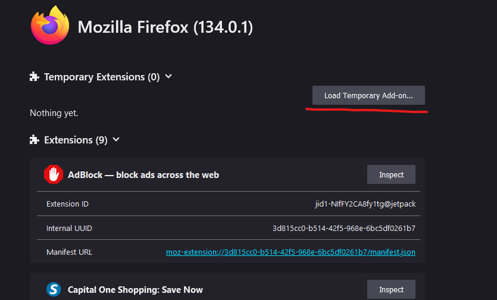
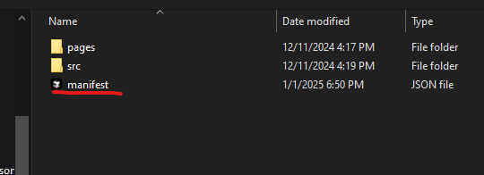

# Overview
A simple app to autofill generated listing details on Depop

# Installation
1. Go into the web browsers manfest file
 
2. Select the manifest.json file from the root directory
3. Click open to load the extension
 

# Dependencies: 
- React
- Llava: https://ollama.com/library/llava; 
- Firefox Extension SDK
- Chrome Extension SDK
- Webpack (WebPack, WebPack CLI, TS-Loader, CopyPlugin)

# Resources
- Converting ImageURL to B64: https://formspree.io/blog/image-to-base64/
- Llava API: https://github.com/ollama/ollama/blob/main/docs/api.md
- Image URL to Blob: https://pqina.nl/blog/convert-a-blob-to-a-file-with-javascript/
- Programmatic Image Upload to Div: https://dev.to/code_rabbi/programmatically-setting-file-inputs-in-javascript-2p7i
- Stale Closure: https://dmitripavlutin.com/react-hooks-stale-closures/

# TODO: 
### Fixes
- Error when generating: "TypeError: NetworkError when attempting to fetch resource"
- Images are not properly deleted when injecting another set
- Moves window when resizing from top or side

### Future
- Sticky on scroll [DONE]
- Button to remove all images [DONE]
- Testing page for depop listing autofill [DONE]
- System for autofilling depop listing content [DONE]
- LLM models wrapping through settings [IGNORE]
- Image padding with gradient
- Allow for LLM Host path to be tested in settings
- Drag-and-drop rearrangement of images in content section [IGNORE]
- Plugin color schemes
- Inject extension into webpage on settings click

### Brainstorming
- General UI Enhancments
- Allow for image croping through UI
- Redo for popup images
- Redo for prompt generation
- Strict prompt generation for brand names
- Prompt generation customization for specific fields in settings
- Corner resizing